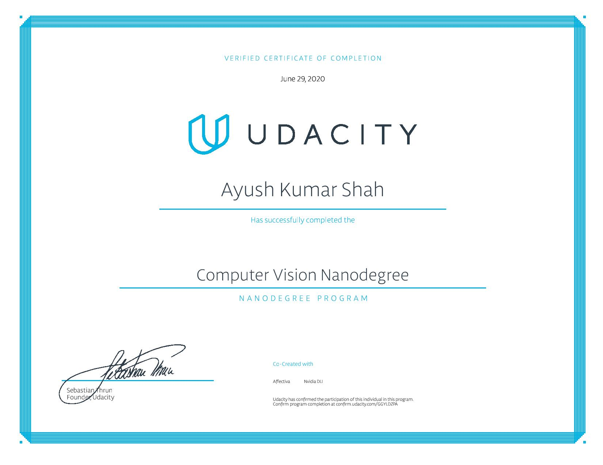

# Computer Vision  Nanodegree Udacity

This repository contains the course materials, notes and projects that I submitted
during the completion of the [Computer Vision Nanodegree](https://www.udacity.com/course/deep-learning-nanodegree--nd891)
provided by [Udacity](https://www.udacity.com/).

## [My notes](https://github.com/ayushkumarshah/Computer-Vision-Nanodegree-Udacity/tree/master/docs/README.md)

- [Module 1: Intro to CV](docs/m1.md)
- [Module 2: Advanced CV and Deep Learning](docs/m2.md)
- [Module 3: Object Tracking and Localization](docs/m3.md)

## Projects submitted

- [Project 1: Facial Keypoints Detection](https://github.com/ayushkumarshah/Computer-Vision-Nanodegree-Udacity/tree/master/Projects/P1_Facial_Keypoints)
- [Project 2: Image Captioning](https://github.com/ayushkumarshah/Computer-Vision-Nanodegree-Udacity/tree/master/Projects/P2_Image_Captioning)
- [Project 3: Simultaneous Localization and Tracking (SLAM)](https://github.com/ayushkumarshah/Computer-Vision-Nanodegree-Udacity/tree/master/Projects/P3_SLAM)

## Certificate:

